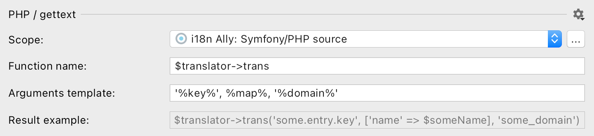

import SupportedFeatures from './partial_blocks/_features_supported.md';
import Scope from './partial_blocks/_scope.mdx';
import ReplacementTemplate from './partial_blocks/_replacement_template.mdx';
import SupportedConstructs from './partial_blocks/_supported_constructs.mdx';
import TranslatableAttribute from './partial_blocks/_translatable_attribute.md';
import InlineTags from './partial_blocks/_inline_tags.md';


# PHP internationalization
```html
<?php
$foo = 'Hello world';
⬇
$foo = trans('hello_world');
// messages.php: 'hello_world' => 'Hello world'

$foo = "Hello world, $user!";
$foo = 'Hello world, ' . $user . '!';
$foo = sprintf('Hello world, %s!', $user);
⬇
$foo = trans('hello_world', ['user' => $user]);
// messages.php: 'hello_world' => 'Hello world, %user%!'
```

## Features supported
<SupportedFeatures/>


## Configure hardcoded strings extraction from Blade templates

The plugin should automatically configure itself for `Laravel`, `Symfony`, `CodeIgniter`, `CakePHP`, `Zend`
and `Laminas` projects, but adjustments could be needed for custom setup and other frameworks.



### Scope
<Scope fileName=".php"/>


:::caution

Important! This source would only looks for hardcoded strings within PHP source codeHTML and outside of PHP snippets.
To extract hardcoded strings from HTML tags configure [an HTML with PHP source](html_php.mdx).

:::

### Inline tags
<InlineTags/>

```html
Three
<p>different</p>
keys.
<!-- ⬇ will be extracted into -->
{{ trans('app.three') }}
<p>{{ trans('app.different') }}</p>
{{ trans('app.keys') }}

One <b>inclusive</b> key.
<!-- ⬇ will be extracted into -->
{!! trans('app.oneInclusiveKey') !!}
```
You can add custom tags, like `icon`, by appending a new tag to the comma-separated list.

### Translatable attribute names
<TranslatableAttribute/>

### Replacement template
The “Replacement template” reflects the result of the hardcoded string extraction.function name and arguments template.

Recommended value for gettext, CodeIgniter, CakePHP and Zend/Laminas: `_('%key%')` with `sprintf` mode enabled.
Recommended value for Yii v2: `_('%namespace%', '%key%', %map%)`.
Recommended value for Yii v3: `_('%key%', %map%, '%namespace%')`.

It could be any callable PHP structure that wraps arguments into parentheses:

function: `_(…)`, `__(…)`,
object method: `$this->trans(…)`, `$translator->trans(…)`,
static method: `\Yii:app(…)`.

<ReplacementTemplate mapTemplate="trans('key', ['foo' => $foo, 'bar' => $bar])"
                         listTemplate="trans('key', [$foo, $bar])"
argsTemplate = "trans('key', $foo, $bar)" />

## Supported language constructs
i18n Ally finds hardcoded user-facing strings within callable context and supports multiple cases:

```jsx
"Welcome, John"     // trans('welcome') simple strings
"Welcome, {$name}"  // trans('welcome', ['name' => $name]) interpolated strings
"Welcome, " . $name // trans('welcome', ['name' => $name]) concatenated strings
sprintf("Welcome, %s", $name) // trans('welcome', ['name' => $name]) // sprintf templates
```

Placeholder names are determined automatically.

## What's not supported

 - Using an array for message retrieval (common approach in PHP legacy codebases, for example `$lang['key']`).


## What strings are skipped

 - All arguments passed to functions or methods (except constructors),
 - HEREDOC and NOWDOC strings,
 - Array keys,
 - Class property definitions,
 - Default paramenter values,
 - Constant name specified in define first argument,
 - Strings assigned to constants,
 - Default argument values
 - Full SQL queries and most of SQL parts,
 - Strings that looks like code: without letters, multiple words without spaces or camelCased ones.

## Best practice: dealing with branching in messages

It’s common to have small and simple branching for presentation purposes:
```html
return <>Webhook {isSuccess ? 'succeeded' : 'failed'}.</>;
```
The best practice it to separate this message into two different ones so translators would have a full context and would be able to adjust word order according the target language grammar.

**1st step**: manually extract the condition out of the message to get two messages without condition
```html
@if ($success)
    Webhook <strong>succeeded</strong>.
@else
    Webhook <strong>failed</strong>.
@endif
```

**2nd step**: replace simple messages with i18n Ally
```html
@if ($success)
    {!! trans('app.webhookSucceeded') !!}
@else
    {!! trans('app.webhookFailed') !!}
@endif
```
