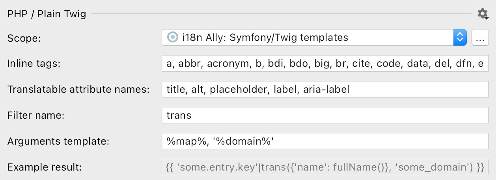

import SupportedFeatures from './partial_blocks/_features_supported.md';
import Scope from './partial_blocks/_scope.mdx';
import ReplacementTemplate from './partial_blocks/_replacement_template.mdx';
import SupportedConstructs from './partial_blocks/_supported_constructs.mdx';
import TranslatableAttribute from './partial_blocks/_translatable_attribute.md';
import InlineTags from './partial_blocks/_inline_tags.md';
import BestPractises from './partial_blocks/_best_practises.mdx';


# Twig templates internationalization
```html
<p>Hello world!</p>
⬇
<p>{{ 'hello_world'|trans }}</p>
<!-- translations/messages.en.yaml: hello_world: 'Hello world!' -->

<p>Hello world, {{ user }}!</p>
⬇
<p>{{ 'hello_world'|trans({'user': user}) }}</p>
<!-- translations/messages.en.yaml: hello_world: 'Hello world, {user}!' -->

<p>Hello <b>world</b>!</p>
⬇
<p>{{ 'hello_world'|trans|raw }}</p>
<!-- translations/messages.en.yaml: hello_world: 'Hello <b>world</b>!' -->
```

## Features supported
<SupportedFeatures/>

## Configure hardcoded strings extraction from Twig templates

The plugin should automatically configure itself for `Symfony` projects, but adjustments could be needed for custom setup.



### Scope
<Scope fileName=".twig"/>

### Inline tags
<InlineTags/>

```html
Three
<p>different</p>
keys.
<!-- ⬇ will be extracted into -->
{{ 'three'|trans }}
<p>{{ 'different'|trans }}</p>
{{ 'keys'|trans }}


One <b>inclusive</b> keys.
<!-- ⬇ will be extracted into -->
{{ 'one_inclusive_key'|trans|raw }}
```
Notice the `raw` filter appended to the key that contains inline tags. i18n Ally adds it automatically to ensure current rendering of the content.

You can add custom tags, like `icon`, by appending a new tag to the comma-separated list.

### Translatable attribute names
<TranslatableAttribute/>

### Filter name
Filter name to use for extraction is the default one in Symfony framework: trans would become `'key'|trans`.

If you have a custom function or an array for fetching translations you [create a custom filter](https://twig.symfony.com/doc/3.x/advanced.html#filters):

```jsx
$filter = new \Twig\TwigFilter('translate', function ($key, $domain = 'messages') {
    textdomain($domain);
    return gettext($key);
});
```

### Replacement template
The “Replacement template” reflects the result of the hardcoded string extraction.function name and arguments template.

Recommended value for `Symfony 3`+: `trans(%map%, '%namespace%')`
with “Skip default namespace” checkbox set to true.

<ReplacementTemplate mapTemplate="{{ 'key'|trans({'foo': foo, 'bar': bar}, 'namespace') }}"
                     listTemplate="{{ 'key'|trans([foo, bar], 'namespace') }}"
                     argsTemplate="{{ 'key'|trans(foo, bar, 'namespace') }}"
                     keyExtraInfo=<NotSupported name="%key%"/>
/>

## Supported language constructs
<SupportedConstructs/>

## What's not supported
 - Strings inside twig expressions, like ``
 - Extraction with function, like `{{ trans('key') %}`, or array, like `{{ lang.key %}`
 - Extraction with trans blocks


## What strings are skipped
 - Pure HTML markup with Twig expressions, like `<a href="{{ route('home') }}"></a>`.
 - All attributes except ones listed in “Translatable attribute names” preference.
 - Content inside `trans` block as it’s assumed to be already extracted.
 - Content inside `verbatim` tag.
 - Content inside `script` and `pre` tags.
 - Strings that looks like code: without letters, multiple words without spaces or `camelCased` ones.

## Best practice: dealing with branching in messages

export const firstBlock = `return <>Webhook {isSuccess ? 'succeeded' : 'failed'}.</>;`


export const firstStep = `@if ($success)
    Webhook <strong>succeeded</strong>.
@else
    Webhook <strong>failed</strong>.
@endif`

export const secondStep = `@if ($success)
    {!! trans('app.webhookSucceeded') !!}
@else
    {!! trans('app.webhookFailed') !!}
@endif`

<BestPractises firstBlock={firstBlock} firstStep={firstStep} secondStep={secondStep}/>


