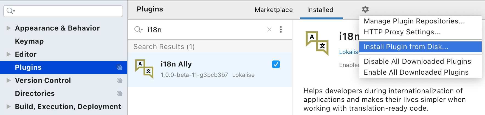

<h1>{{ page.title }}</h1>

## Automatically extract hardcoded strings

    <iframe width="560" height="315" src="https://www.youtube.com/embed/3Lnt-aBy98E?rel=0" frameborder="0" allow="accelerometer; autoplay; clipboard-write; encrypted-media; gyroscope; picture-in-picture" allowfullscreen></iframe>

* Top menu → Tools Run → i18n Ally inspections…
* Specify what files to check (use "Whole project" if unsure) [as described in the JetBrains documentation](https://www.jetbrains.com/help/idea/specify-inspection-scope-dialog.html).
* Open a tree of inspection results up to the last level.
* Click on the first problem found.
* Press `Alt+Enter` (called "Show Context Actions" in Preferences → Keymap)
* Select extraction.
* Select where to extract, if having a multiple translation files per language and confirm selection by pressing `Enter`.
* Edit a translation key and confirm extraction by pressing `Enter`.

## Install closed beta version from a received file

{:width="884px" height="auto"}

* Go to Preferences, then Plugins
* Click on the ⚙️ cog icon
* Select Install plugin from disk...
* Select plugin archive
* Click apply

All necessary dependencies are bundled into PhpStorm:

* Required (will be automatically asked to install):
  * `org.jetbrains.plugins.yaml` is used for detecting Symfony configuration,
  * `com.intellij.database` for storing and reading plugin settings and translation keys.
* Optional (feature will not work if not present):
  * `com.jetbrains.php` for PHP source,
  * `com.jetbrains.twig` for Twig source,
  * `org.jetbrains.plugins.yaml` for YAML language file type.

## Previewing the docs locally

Prerequisites: [Ruby v2.*](https://www.ruby-lang.org/en/documentation/installation/#homebrew), [Bundler](https://bundler.io/).

1. Clone the repo.
2. Run `bundle install --path vendor/bundle`
3. Run `bundle exec jekyll serve --baseurl='' --config _config.yml,_config_dev.yml`.
4. Navigate to `http://localhost:4000` and observe the docs.
