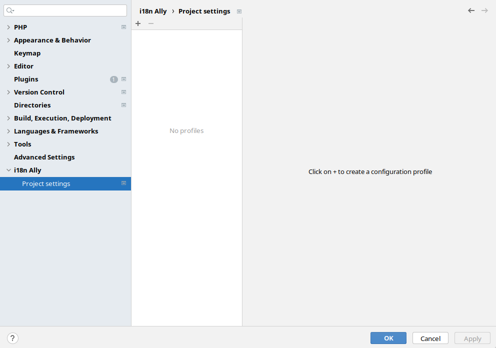
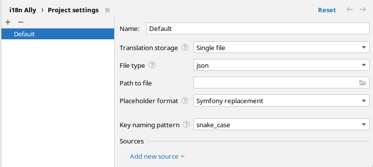
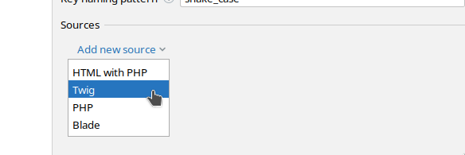
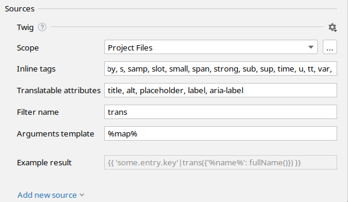
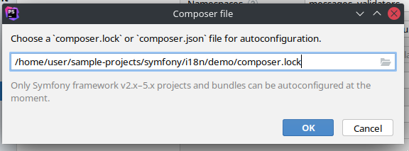

<h1>Plugin UI settings</h1>

Plugin UI settings is a part of the plugin (configuration) which controls how the plugin works, including the
function names, naming structure, where source/sink files will be detected/scanned, etc.

All the profile settings are saved to and read from the project root in `i18nally.json` file, which can be re-used 
across projects (if necessary) and manually edited.

## Usage

The plugin UI settings can be accessed by first opening the settings window via `Ctrl + Alt + s` 
(`Cmd + Option + s` in MacOS) or opening the menu `File | "Settings..."` and navigating to 
`i18n Ally | Project settings`.

Next step is to click the `+` icon to create a profile, choose either `"Configure manually"` or 
`"Configure from composer"`.

For manual configuration you will need to manually configure the sink and source settings, but using the 
composer option (limited to Symfony), a profile is generated automatically created along with a scope.

## Profiles

Profiles can be created and modified in 2 ways:
1. Plugin UI settings
2. `i18nally.json` file

### Create a profile from the plugin UI settings

Profiles can be created either manually or choosing the autoconfiguration via composed option.

If the "[Plug and play configuration]({{ 'plug-and-play-configuration' | resource_url }})" feature has not already
created profiles automatically, there should not be any profiles and the settings will look like this

**Manual configuration**

Add a new entry manually and configure the sink

- Optionally, choose a meaningful name (e.g., Twig into YAML for such source-sink combination).
- Choose the appropriate "Translation storage", "File type" and a path to the sink file (mandatory).

The last step is to configure the source, choose the appropriate source

It is now possible to save and create the configuration file

To ensure that there are minimal false positives and negatives, it is recommended to perform further configuration.

For example:
- Change the scope to include files that only contain user facing strings like templates (views for MVC type frameworks).
    - You will need to create a scope for this, which ([see PhpStorm documentation on scopes](https://www.jetbrains.com/help/phpstorm/configuring-scopes-and-file-colors.html))

**Configuration via composer**

Note: ***Only Symfony framework v2.x-5.x projects amd bundles can be autoconfigured at the moment.***

Choose "Configure from composer", the plugin will automatically look for a `compose.lock` file in the project folder and
prefill the input field

- If not automatically detected, then provide the path to either `compose.json` or `compose.lock`.

By clicking `"OK"` a new profile and/or scope will be created based on the `compose` file.

## Language file configuration

The settings for sink are explained in [this page]({{ '/language-files/' | global_asset_url }}).

## Source configuration

For now there are 4 supported sources (Vue/JS coming soon)

- [Blade]({{ '/source-code/blade' | global_asset_url }})
- [Twig]({{ '/source-code/twig' | global_asset_url }})
- [HTML with PHP]({{ '/source-code/phphtml' | global_asset_url }})
- [PHP]({{ '/source-code/php' | global_asset_url }})

### Multiple source configuration 

Add another source either by clicking the `Cog icon | "Duplicate"` or by clicking `"Add new source"`.

For such profile, only one sink file will be used for multiple sources.

## Additional notes

### Reset option

By clicking the `"Reset"` text on the top right (which shows up after making changes), the profile settings will, be 
reset to the state before pressing `"Apply"`.

### Cog icon

Under `"Sources"` section, far right of the source name, click the cog icon to either `"Duplicate"` or `"Remove"` the source.

### Configuration via `i18nally.json`

After creating profile, to edit an existing profile or add new profiles:
1. Open the file in the editor 
2. Find the JSON object with the existing profile

Now you can edit its values, but to create a new profile

3. Copy and paste object, right after the original
4. Edit the id, making sure it's unique
5. At last change its name.

By visiting the plugin UI settings, there should be a new entry if done correctly.
