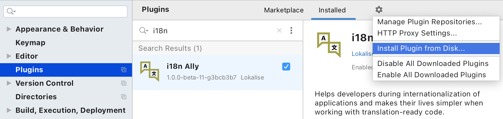

# i18n Ally JetBrains plugin (closed beta)

Install from a received file:

## Install closed beta version from files

{:width="884px" height="auto"}

* Go to Preferences, then Plugins
* Click on the ⚙️ cog icon
* Select Install plugin from disk...
* Select plugin archive
* Click apply

## Additional info

TBD

## Previewing the docs locally

Prerequsites: [Ruby v2.*](https://www.ruby-lang.org/en/documentation/installation/#homebrew), [Bundler](https://bundler.io/).

1. Clone the repo.
2. Run `bundle install --path vendor/bundle`
3. Run `bundle exec jekyll serve --baseurl=''`.
4. Navigate to `http://localhost:4000` and observe the docs.
