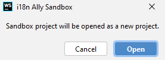

# Sandbox

When it comes to configuration combinations and checking new features that you are going to use it ia alwasy better to have a playground.

For this reason we have bundled a sandbox project inside our plugin.

To open it, you need:
- Go to `File | Settings | i18n Ally | About` (`Preferences` instead of settings on MacOs)
- Click `Open sandbox` link
- Close settings window
- Click `Open` in dialog window

    
- **ide-sample-code** project will be opened in new window

Have fun testing our features 😎

:::info

Every time you open sandbox via settings it will refresh **ide-sample-code** project to it initial state.

Sometimes IDE will say that memory changes are not the same as disk changes, then always choose disk changes to have a fresh sandbox state.

:::
