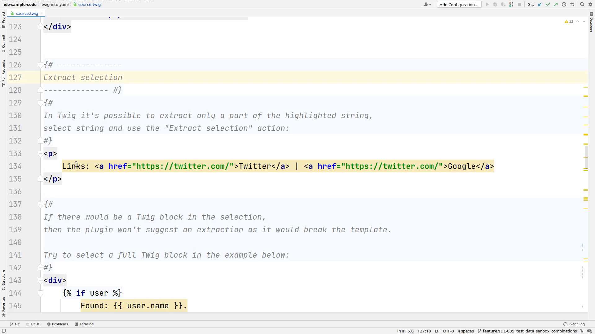

# Extract selection

Extract hard-coded string by selection a part of a string, including a full selection.

If the selection included untranslatable elements like directives in Blade or expressions 
in Twig or full PHP code in HTML with PHP, no option for extraction will be provided as it would break the template.

## Usage
Select a part of the string and via the context menu and selecting “Context actions” 
or with hot keys `Alt + Enter` (`Option + Return` in MacOS).

## Supported sources
 - [Twig](source-code/twig.mdx)
 - [Blade](source-code/blade.mdx)
 - [HTML with PHP](source-code/phphtml.mdx)

## Unsupported sources
 - [PHP](source-code/php.mdx)