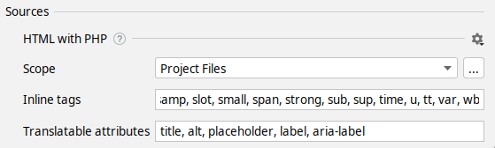

# Inline tag extraction 

Extraction of inline tags lets the user to extract either the whole tag or a tags attribute.

## Configuration

The detection of hard-coded string will work differently, depending on the configured inline-tags



If the inline tags are configured, they will be detected as hard-coded strings and can be extracted, otherwise, not detected.

## Supported sources
The behavior for this feature will differ from source to source and how it treats inline tags

## Blade and Twig
Both of these sources will apply escaped formatting on the tags

### Blade
```html
<!-- When extracting the string below -->
<p>
    Links: <a href="https://twitter.com/">Twitter</a> | <a href="https://twitter.com/">Google</a>
</p>
<!-- The string with inline tags is escaped -->
<p>
    {!! trans('language-file.linksTwitterGoogle') !!}
</p>
```

### Twig
```html
<!-- When extracting the string below -->
<p>
    Links: <a href="https://twitter.com/">Twitter</a> | <a href="https://twitter.com/">Google</a>
</p>
<!-- The string with inline tags is escaped with the raw filter -->
<p>
    links_twitter_google
</p>
```

## Not supported sources
[**Vue**](source-code/vue.mdx) - Not supported yet

[**PHP**](source-code/php.mdx) and [**JS**](source-code/js-and-ts.mdx) - These sources have no concept of inline tags, but are dealing with strings, thus there is no configuration
and inline tags are considered the same as regular strings.