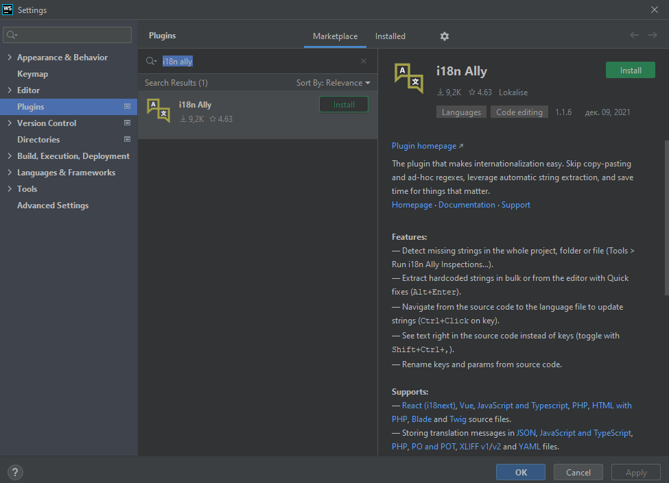
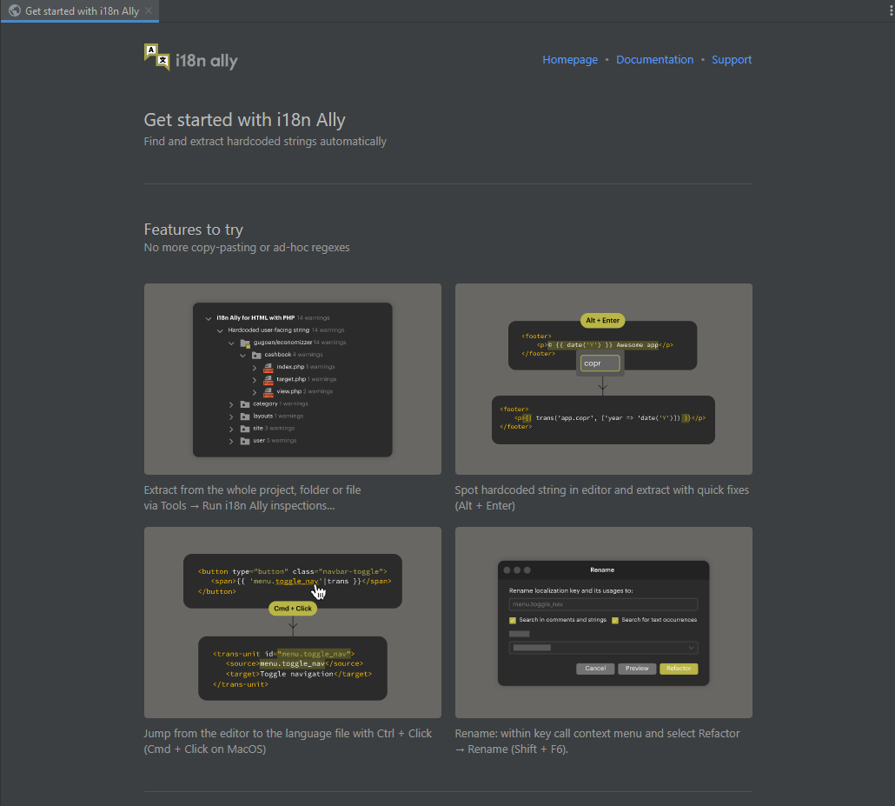

import Tabs from '@theme/Tabs';
import TabItem from '@theme/TabItem';

## Prerequisites

 - One of [supported IDE's](../ide-support.md).
 - React application
 - Feeling that you are ready to start you localisation path 😎

## Install the i18n ally plugin

Open your IDE:
<Tabs groupId="operating-systems">
    <TabItem value="mac" label="MacOs" default>
       <code>Preferences | Plugins </code>
    </TabItem>
    <TabItem value="win" label="Windows">
        <code>File | Settings | Plugins </code>
    </TabItem>
    <TabItem value="linux" label="Linux">
        <code>Preferences | Plugins </code>
    </TabItem>
</Tabs>

Choose `Marketplace`, type `i18n ally` and click `Install` button

Restart you IDE and you will see our starting tab

:::info

If something is unclear or not working you can always use Live Support chat to contact us.

:::