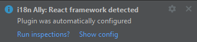

import Tabs from '@theme/Tabs';
import TabItem from '@theme/TabItem';

1. If you are using **react-i18next** dependency in your **package.json**, the plugin should autoconfigure itself.

    Pop-up will appear:

    

    :::info

    We are checking only `dependencies` and `devDependencies` objects in `package.json`.

    For translations, we are looking for well known directories such as:

    `[ i18n, l10n, lang, language, local, locale, message, translation, resource ]`

    :::

2. If autoconfiguration failed you will see another pop-up:

    

    In both cases our next step is to check our configuration

    Click on **show config** button otherwise go directly to:

    <Tabs groupId="operating-systems">
        <TabItem value="mac" label="MacOs" default>
            <code>Preferences | i18n Ally | Project settings </code>
        </TabItem>
        <TabItem value="win" label="Windows">
            <code>File | Settings | i18n Ally | Project settings</code>
        </TabItem>
        <TabItem value="linux" label="Linux">
            <code>Preferences | i18n Ally | Project settings</code>
        </TabItem>
    </Tabs>

Now you can specify the following settings:

#### Common
 - **Translation storage**: single or namespaced
 - **Placeholder format**: format to store placeholder name in a language file
 - **Nesting separator**: nesting keys separator
 - **Key naming pattern**: describing how to generate key names from the source string

#### Namespaced
- **Translations directory**:  folder that contains language files for all locales
- **Default locale**: strings will be extracted into this locale
- **Namespaces**: a comma-separated list of namespace part in the language file name
- **Filename template**: a template to build a filename where to extract strings
- **Filepath**: path to translation file of [supported format](/jetbrains/file-formats)

#### Single
- **Path to file**: path to translation file of [supported format](/jetbrains/file-formats)

After you set up profile we can move to overview the source configuration.

:::info

You can read more about profile configuration fields **[here](/jetbrains/advanced/profile-settings)**

By default, a config `i18nally.json` file is located in your `.idea` folder inside your project.

:::
