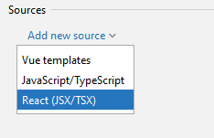
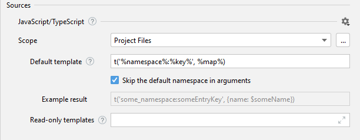
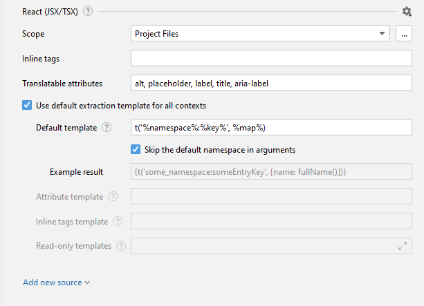

# Configure sources

First if autoconfiguration failed we need to set up sources manually

For react project we would like to have 2 sources:
- [Javascript/Typescript](/jetbrains/source-code/js-and-ts) -  for javascript files

- [React(JSX/TSX)](/jetbrains/source-code/react-jsx-tsx) - for jsx/tsx files

You can see that for different sources they are slightly different.
Globally we have 2 types of sources: plain language and html based

Now lets cover all fields:
- **Scope**: scope of files for applying i18n ally inspections
- **Default template**: determines the source code that would be placed instead of the extracted string
- **Example Result**: based on default template, so you can see the result of future extractions
- **Read-only templates**: keys would be recognized by these templates, but you can't extract using them

- **Inline tags**: [fill this]
- **Translatable attributes**: [fill this]
- **Use default extraction template for all context checkbox**: when checked for all extraction and detection **Default template** would be used
- **Attribute template**: Replacement template that would be used only when extracting from attributes
- **Inline tags template**: Replacement template that would be used when extracting a string that contains one of the inline tags listed above

Now let's imagine that we want to check for hardcoded string only files that starting with `hardcoded` prefix.

We need to define a custom scope for this

After all fields are defined we should save the configuration and proceed to the last step of our guide - actual using of plugin.

:::info

You can read more about source configuration fields **[here](/jetbrains/advanced/source-settings)**.

:::