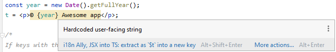

# Working with plugin

At last, we are at the end of our guide.
And now we will test that everything setup right.

First lets check that hardcoded string is highlighted, and we can extract it:

You can use intention menu or hotkeys for extraction.

- Ide will suggest you a key for you entry, based on the **key naming pattern**
- Extraction will be made based on the defined **template** and **placeholder format** that we covered before

Now we will check another plugin feature [localisation hints](/jetbrains/features/localization-hints), and we will see what is actually stored in our translation file.

We have two options here:
 - Use hotkeys `Ctrl + Shift + ,` (`Cmd + Shift + ,` on MacOS)
 - Right click in the `Editor | i18n Ally Inspections | "Enable/Disable localization hints"`

And finally we will use [navigation](/jetbrains/features/navigate-to-translation) from our source file to our translation file.
With `Ctrl` (`Cmd` on MacOS) click on our key.

You can explore more of our features [here](/jetbrains/features).

:::info

If something is not working, most likely configuration is broken.

Also, you can always check every feature and settings combinations inside our **[sandbox](/jetbrains/advanced/sandbox)**.

:::
