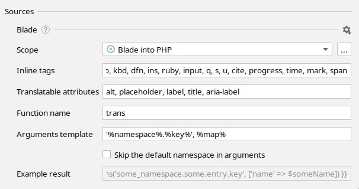

import SupportedFeatures from './_partials/_features_supported.md';
import Scope from './_partials/_scope.mdx';
import ReplacementTemplate from './_partials/_replacement_template.mdx';
import SupportedConstructs from './_partials/_supported_constructs.mdx';
import TranslatableAttribute from './_partials/_translatable_attribute.md';
import InlineTags from './_partials/_inline_tags.md';


# Blade templates internationalization
```html
<p>Hello world!</p>
⬇
<p>{{ trans('app.helloWorld') }}</p>
<!-- resources/lang/en/messages.php: 'helloWorld' => 'Hello world!' -->

<p>Hello world, {{ $user }}!</p>
⬇
<p>{{ trans('app.helloWorld', ['user' => $user]) }}</p>
<!-- resources/lang/en/messages.php: 'helloWorld' => 'Hello world, :user!' -->

<p>Hello <b>world</b>!</p>
⬇
<p>{!! trans('app.helloWorld') !!}</p>
<!-- resources/lang/en/messages.php: 'helloWorld' => 'Hello <b>world</b>!' -->
```

## Features supported
<SupportedFeatures/>


## Configure hardcoded strings extraction from Blade templates

The plugin should automatically configure itself for `Laravel` projects, but adjustments could be needed for custom setup.



### Scope
<Scope fileName=".blade.php"/>

### Inline tags
<InlineTags/>

```html
Three
<p>different</p>
keys.
<!-- ⬇ will be extracted into -->
{{ trans('app.three') }}
<p>{{ trans('app.different') }}</p>
{{ trans('app.keys') }}

One <b>inclusive</b> key.
<!-- ⬇ will be extracted into -->
{!! trans('app.oneInclusiveKey') !!}
```
You can add custom tags, like `icon`, by appending a new tag to the comma-separated list.

### Translatable attribute names
<TranslatableAttribute/>

### Replacement template
The “Replacement template” reflects the result of the hardcoded string extraction.function name and arguments template.
Recommended value for Laravel v5.0+: `trans('%namespace%.%key%', %map%)`<br/>
with "Skip default namespace" checkbox set to `false`.
<ReplacementTemplate mapTemplate="trans('namespace.key', ['foo' => $foo, 'bar' => $bar])"
                     listTemplate="trans('namespace.key', [$foo, $bar])"
                     argsTemplate = "trans('namespace.key', ($foo, $bar))" />

## Supported language constructs
<SupportedConstructs/>

## What's not supported

- Extracting strings from blade expressions, like `{{ someFunc('Hello world!') }}`
- Strings from blade directives, like `@if ($foo === 'Hello world!')`
- Renaming key names from language files


## What strings are skipped

- Pure HTML markup with blade expressions, like `<a href="{{ route('home') }}"></a>`.
- All attributes except ones listed in "Translatable attribute names" preference.
- Content inside `trans` block as it's assumed to be already extracted.
- Content inside `verbatim` directive.
- Content inside `script` and `pre` tags.
- Strings that looks like code: without letters, multiple words without spaces or `camelCased` ones.
- Strings inside expressions and directives, like `@auth('Hello world!')`

## Best practice: dealing with branching in messages

It’s common to have small and simple branching for presentation purposes:
```html
return <>Webhook {isSuccess ? 'succeeded' : 'failed'}.</>;
```
The best practice it to separate this message into two different ones so translators would have a full context and would be able to adjust word order according the target language grammar.

**1st step**: manually extract the condition out of the message to get two messages without condition
```html
@if ($success)
    Webhook <strong>succeeded</strong>.
@else
    Webhook <strong>failed</strong>.
@endif
```

**2nd step**: replace simple messages with i18n Ally
```html
@if ($success)
    {!! trans('app.webhookSucceeded') !!}
@else
    {!! trans('app.webhookFailed') !!}
@endif
```
