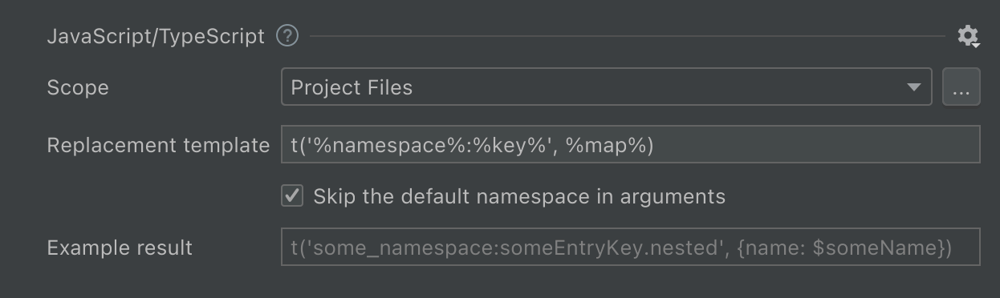

import SupportedFeatures from './partial_blocks/_features_supported.md';
import Scope from './partial_blocks/_scope.mdx';
import ReplacementTemplate from './partial_blocks/_replacement_template.mdx';
import SupportedConstructs from './partial_blocks/_supported_constructs.mdx';
import TranslatableAttribute from './partial_blocks/_translatable_attribute.md';


# JavaScript/TypeScript internationalization
```javascript
const foo = 'Hello world!';
⬇
const foo = $t('helloWorld');
// locales/en.js: 'helloWorld' => 'Hello world!'

const foo = `Welcome, ${name}`;
const foo = 'Welcome, ' + name;
⬇
const foo = $t('welcome', {name: name});
// locales/en.js: 'welcome' => 'Welcome, {user}!'
```

## Features supported
<SupportedFeatures />

## Configure hardcoded strings extraction from Javascript/Typescript templates
The plugin should automatically configure itself for project with dependencies on `vue-i18n` and `nuxt-i18n`, but adjustments could be needed for custom setup.



### Scope
<Scope fileName=".js/.ts" />

### Inline tags
Extraction of strings with a special treatment of inline tags is not currently supported.

### Translatable attribute names
<TranslatableAttribute/>

### Replacement template
The “Replacement template” reflects the result of the hardcoded string extraction.function name and arguments template.

It could be any callable JavaScript structure that wraps arguments into parentheses:

 - function: `$t(…), __(…)`,
 - object method: `this.$t(…), parent.$t(…)`.

<ReplacementTemplate mapTemplate="$t('key', {foo: fooVariable, bar: barVariable})"
                     listTemplate="$t('key', [fooVariable, barVariable])"
                     argsTemplate="$t('key', fooVariable, barVariable)"/>

## Supported language constructs
i18n Ally finds hardcoded user-facing strings and template literals:
```js
'Welcome, John'     // $t('welcome') simple strings
`Welcome, {name}`  // $t('welcome', {name: name}) template literals
'Welcome, ' + name // $t('welcome', {name: name}) concatenated strings
```
Placeholder names are determined automatically.

## What’s not supported
???

## What strings are skipped
 - All arguments passed to functions or methods (except constructors), but avaialbe to unignore case by case
 - Array keys,
 - Indexed array,
 - Class property definitions,
 - Default parameter values,
 - Strings that looks like code: without letters, multiple words without spaces or camelCased ones.

## Best practice: dealing with branching in messages
It’s common to have small and simple branching for presentation purposes:
```js
const foo = `Webhook <strong>${isSuccess ? 'succeeded' : 'failed'}</strong>.`;
```
The best practice it to separate this message into two different ones so translators would have a full context and would be able to adjust word order according the target language grammar.

**1st step**: manually extract the condition out of the message to get two messages without condition
```js
const foo = isSuccess
  ? 'Webhook <strong>succeeded</strong>.'
  : 'Webhook <strong>failed</strong>.';
```

**2nd step**: replace simple messages with i18n Ally
```js
const foo = isSuccess
  ? $t('webhookSucceeded')
  : $t('webhookFailed');
```
