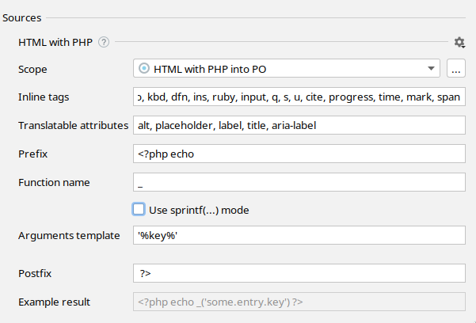

import SupportedFeatures from './partial_blocks/_features_supported.md';
import Scope from './partial_blocks/_scope.mdx';
import ReplacementTemplate from './partial_blocks/_replacement_template.mdx';
import SupportedConstructs from './partial_blocks/_supported_constructs.mdx';
import TranslatableAttribute from './partial_blocks/_translatable_attribute.md';
import InlineTags from './partial_blocks/_inline_tags.md';

# PHP views internationalization

```html
<p>Hello world!</p>
⬇
<p><?php _('Hello world') ?></p>
<!-- messages.po: msgid "Hello world" -->

<p>Hello world, <?php $user ?>!</p>
⬇
<p><?php sprintf(_('Hello world, %1$s!'), $user) ?></p>
<!-- messages.po: msgid "Hello world, %1$s!" -->
```

## Features supported
<SupportedFeatures/>

## Configure hardcoded strings extraction from PHP views
The plugin should automatically configure itself for `CodeIgniter`, `CakePHP`, `Zend` and `Laminas` projects,
but adjustments could be needed for custom setup and other frameworks.



### Scope
<Scope fileName=".php"/>

### Inline tags
<InlineTags/>

```html
Three
<p>different</p>
keys.
<!-- ⬇ will be extracted into -->
<?php _('Three') ?>
<p><?php _('different') ?></p>
<?php _('keys.') ?>


One <b>inclusive</b> key.
<!-- ⬇ will be extracted into -->
<?php _('One <b>inclusive</b> key.') ?>
```

You can add custom tags, like `icon`, by appending a new tag to the comma-separated list.

### Translatable attribute names
<TranslatableAttribute/>

### Replacement template
The “Replacement template” reflects the result of the hardcoded string extraction.function name and arguments template.

Recommended value for gettext, CodeIgniter, CakePHP and Zend/Laminas: `_('%key%')` with `sprintf` mode enabled.
Recommended value for Yii v2: `_('%namespace%', '%key%', %map%)`.
Recommended value for Yii v3: `_('%key%', %map%, '%namespace%')`.

It could be any callable PHP structure that wraps arguments into parentheses:

function: `_(…)`, `__(…)`,
object method: `$this->trans(…)`, `$translator->trans(…)`,
static method: `\Yii:app(…)`.

<ReplacementTemplate mapTemplate="<?php echo trans('key', ['foo' => $foo, 'bar' => $bar]) ?>"
                     listTemplate="<?php echo trans('key', [$foo, $bar]) ?>"
                     argsTemplate="<?php echo trans('key', $foo, $bar) ?>"/>

## Supported language constructs
i18n Ally finds hardcoded user-facing strings are only detected inside HTML tags.

Placeholder names are determined automatically.

## What’s not supported
 - Using an array for message retrieval (common approach in PHP legacy codebases, for example `$lang['key']`).

## What strings are skipped
 - Pure HTML markup with PHP snippets expressions, like `<a href="<?php route('home')?>"></a>`.
 - All attributes except ones listed in “Translatable attribute names” preference.
 - Content inside `script` and `pre` tags.
 - Strings that looks like code: without letters, multiple words without spaces or `camelCased` ones.

## Best practice: dealing with branching in messages
It’s common to have small and simple branching for presentation purposes:
```jsx
Webhook <strong><?php echo $success ? 'succeeded' : 'failed' ?></strong>.
```
The best practice it to separate this message into two different ones so translators would have a full context and would be able to adjust word order according the target language grammar.

**1st step**: manually extract the condition out of the message to get two messages without condition
```jsx
<?php if ($success) { ?>
    Webhook <strong>succeeded</strong>.
<?php } else { ?>
    Webhook <strong>failed</strong>.
<?php } ?>
```

**2nd step**: replace simple messages with i18n Ally
```jsx
<?php
    if ($success) {
        echo _('Webhook <strong>succeeded</strong>.')
    } else {
        echo _('Webhook <strong>failed</strong>.')
    }
?>
```