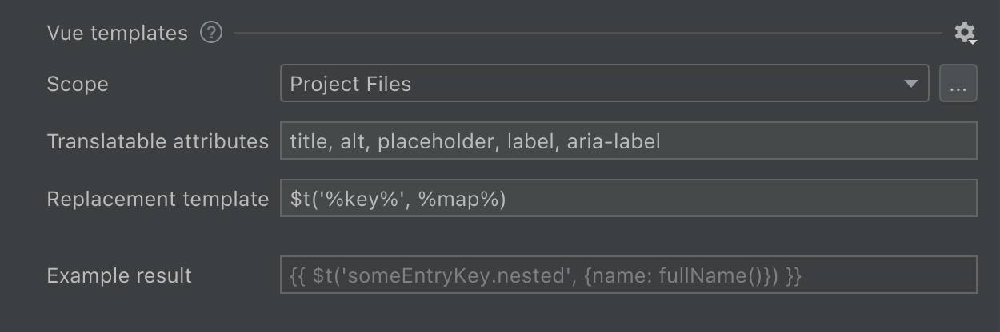

import SupportedFeatures from './_partials/_features_supported.md';
import Scope from './_partials/_scope.mdx';
import ReplacementTemplate from './_partials/_replacement_template.mdx';
import SupportedConstructs from './_partials/_supported_constructs.mdx';
import TranslatableAttribute from './_partials/_translatable_attribute.md';


# Vue templates
```html
<p>Hello world!</p>
⬇
<p>{{ $t('helloWorld') }}</p>
<!-- locales/en.js: helloWorld: 'Hello world!' -->

<p>Hello, {{ user }}!</p>
⬇
<p>{{ $t('hello', {user: user}) }}</p>
<!-- locales/en.js: helloWorld: 'Hello, {user}!' -->

<p>Hello, {{ user }}!</p>
⬇
<p>{{ $t('hello', [user]) }}</p>
<!-- locales/en.js: helloWorld: 'Hello, {0}!' -->
```

## Features supported
<SupportedFeatures />

## Configure hardcoded strings extraction from Vue templates
The plugin should automatically configure itself for project with dependencies on `vue-i18n` and `nuxt-i18n`, but adjustments could be needed for custom setup.



### Scope
<Scope fileName=".vue"/>

### Inline tags
Extraction of strings with a special treatment of inline tags is not currently supported.

### Translatable attribute names
<TranslatableAttribute/>

### Replacement template
The “Replacement template” reflects the result of the hardcoded string extraction.function name and arguments template.

Recommended value for `vue-i18n` and `nuxt-i18n` packages: `$t('%key%', %map%)`.

<ReplacementTemplate mapTemplate="$t('key', {foo: fooVariable, bar: barVariable})"
                     listTemplate="$t('key', [fooVariable, barVariable])"
                     argsTemplate="$t('key', fooVariable, barVariable)"/>

## Supported language constructs
<SupportedConstructs/>

## What’s not supported
- Extracting strings from expressions, like `{{ someFunc('Hello world!') }}`
- Reading and extracting keys from a `<i18n>` tag within single-file components
- Renaming key names from language files

## What strings are skipped
- All attributes except ones listed in “Translatable attribute names” preference.
- Strings that looks like code: without letters, multiple words without spaces or `camelCased` ones.

## Best practice: dealing with branching in messages
It’s common to have small and simple branching for presentation purposes:
```js
return <>Webhook {isSuccess ? 'succeeded' : 'failed'}.</>;
```
The best practice it to separate this message into two different ones so translators would have a full context and would be able to adjust word order according the target language grammar.

**1st step**: manually extract the condition out of the message to get two messages without condition
```js
return isSuccess
  ? return <>Webhook succeeded.</>
  : return <>Webhook failed.</>;
```

**2nd step**: replace simple messages with i18n Ally
```js
return isSuccess
    ? return <>{t('webhookSucceeded')}</>
    : return <>{t('webhookFailed')}</>;
```
