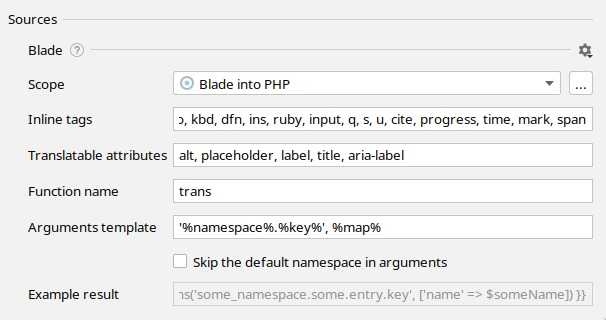

<h1>Blade templates internationalization</h1>



Hello world!

⬇

{{ trans('app.helloWorld') }}

<!-- resources/lang/en/messages.php: 'helloWorld' => 'Hello world!' -->

Hello world, {{ $user }}!

⬇

{{ trans('app.helloWorld', ['user' => $user]) }}

<!-- resources/lang/en/messages.php: 'helloWorld' => 'Hello world, :user!' -->

Hello <b>world</b>!

⬇

{!! trans('app.helloWorld') !!}

<!-- resources/lang/en/messages.php: 'helloWorld' => 'Hello <b>world</b>!' -->


<h3>Table of contents</h3>
* TOC
{:toc}

# Features supported



# Configure hardcoded strings extraction from Blade templates

The plugin should automatically configure itself for Laravel projects, but adjustments could be needed for custom setup.

{:width="629px" height="auto"}






Three

different

keys.
<!-- ⬇ will be extracted into -->
{{ trans('app.three') }}

{{ trans('app.different') }}

{{ trans('app.keys') }}

One <b>inclusive</b> key.
<!-- ⬇ will be extracted into -->
{!! trans('app.oneInclusiveKey') !!}








By default it's `trans` from Laravel framework.




Recommended value for Laravel v5.0+: `'%namespace%.%key%', %map%` 
with "Skip default namespace" checkbox set to `false`.



# Supported language constructs

All strings inside tags and translatable attributes are checked.

# What's not supported

* Extracting strings from blade expressions, like `{{ someFunc('Hello world!') }}`
* Strings from blade directives, like `@if ($foo === 'Hello world!')`
* Renaming key names from language files

# What strings are skipped

* Pure HTML markup with blade expressions, like ``.
* All attributes except ones listed in "Translatable attribute names" preference.
* Content inside `trans` block as it's assumed to be already extracted.
* Content inside `verbatim` directive.
* Content inside `script` and `pre` tags.
* Strings that looks like code: without letters, multiple words without spaces or `camelCased` ones.
* Strings inside expressions and directives, like `@auth('Hello world!')`

# Best practice: dealing with branching in messages

It's common to have small and simple branches in blade templates for presentation purposes:

Webhook <strong>{{ $success ? 'succeeded' : 'failed' }}</strong>.


The best practice it to separate this message into two different ones so translators would be a full context and would 
be able to adjust word order according the target language grammar.

**1st step:** manually extract the condition out of the message to get two messages without condition

@if ($success)
    Webhook <strong>succeeded</strong>.
@else
    Webhook <strong>failed</strong>.
@endif


**2nd step:** replace simple messages with i18n Ally

@if ($success)
    {!! trans('app.webhookSucceeded') !!}
@else
    {!! trans('app.webhookFailed') !!}
@endif

