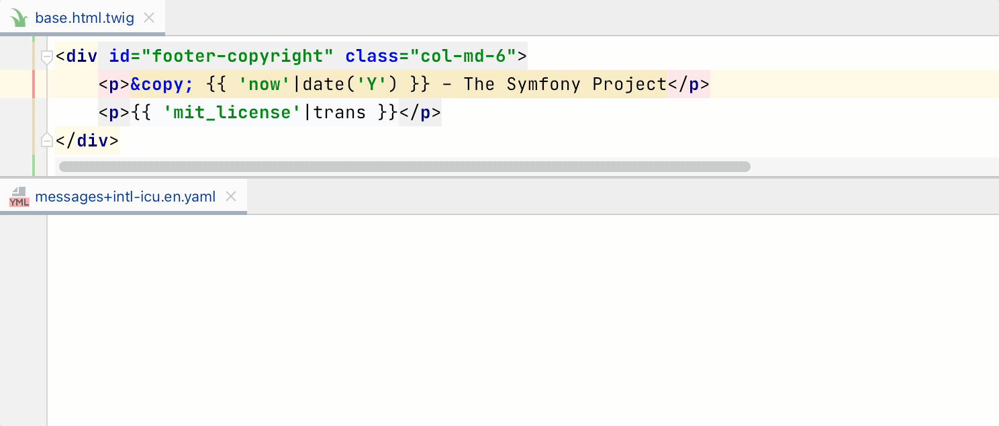
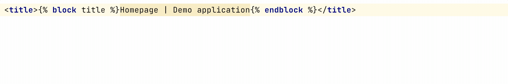

# Blade source configuration

{:width="629px" height="auto"}

## Scope

i18n Ally is applying inspections for files that have `.blade.php` extension and are included into
[a PhpStorm's scope](https://www.jetbrains.com/help/phpstorm/settings-scopes.html#d55e18f7).

Create a new scope or adjust existing by clicking on `…` button and handpicking only the meaningful directories and files.

Select `Project files` to include all PHP files in your project. Note that for frameworks that have autoconfiguration
the relevant scope would be specified automatically.

## Inline tags

List of tags that would be taken inside keys, like `a`, `strong` or `span`. Filled by default with
[all "inline" tags listed on MDN](https://developer.mozilla.org/en-US/docs/Web/HTML/Inline_elements#elements).

An example of extraction result difference between block and inline tags:



    Three 
different
 pieces.
    {{ trans('language-file.three') }} 
{{ trans('language-file.different') }}
 {{ trans('language-file.pieces') }}

    One <b>big</b> piece.
    {{ trans('language-file.oneBigPiece') }}



You can add custom tags, like `icon`, by appending a new tag to the comma-separated list.

## Translatable attribute names

Translatable attributes are also checked for the translatable text:





You can add custom attributes, like `data-content`, by appending a new attribute to the comma-separated list.

## Function name

Function name to use for extraction is the default one in Symfony framework: `trans` would become 
`trans('key')`.

If you have a custom function or an array for fetching translations you can 
[create a custom function](https://laravel.com/docs/5.8/blade#extending-blade):


<?php

namespace App\Providers;

use Illuminate\Support\Facades\Blade;
use Illuminate\Support\ServiceProvider;

class AppServiceProvider extends ServiceProvider
{
    /**
     * Register bindings in the container.
     *
     * @return void
     */
    public function register()
    {
        //
    }

    /**
     * Bootstrap any application services.
     *
     * @return void
     */
    public function boot()
    {
        Blade::directive('datetime', function ($expression) {
            return "<?php echo ($expression)->format('m/d/Y H:i'); ?>";
        });
    }
}


## Arguments template

### `%map%`

Map means an associative array that:

* won't be replaced with anything if there are no placeholders use and the default domain is used: `trans('key')`,
* will be replaced as an associative short syntax array if there are any placeholders detected: 
`trans('key', ['%placeholder%' => placeholder])`.

Initial placeholder names are determined automatically based on a respective variable.

### `%namespace%`

Namespace (called 'domain' in Symfony) usually means a part of language file path from where translations would be searched for. The default 
namespace is usually `messages`, but could be changed by specifying different first namespace in 
[the Symfony language file](/configure-language-files/symfony).

## Supported language constructs

All strings inside tags and translatable attributes are checked.

## What's not supported

* Strings inside blade expressions, like `someFunc('String param.')`
* Strings within blade directives, like `@if ('this tring' === 1)`
* Renaming key names from sink

## What strings are skipped

* Pure HTML markup with blade expressions, like `
<b>{{ 'summary'|trans }}</b>
`.
* All attributes except ones listed in "Translatable attribute names" preference.
* Content inside `trans` block as it's assumed to be already extracted.
* Content inside `verbatim` tag.
* Content inside `script` and `pre` tags.
* Strings that looks like code: without letters, multiple words without spaces or `camelCased` ones.
* Strings inside directives, like `@auth('admin')`

## Renaming from the editor

If an existing key or automatically captured placeholder is not an optimal one you can rename the right from the editor.

Just put a cursor on a key or a placeholder in source code, then hit `Shift+F6` or right click → hover over `Refactor` → click on `Rename…`:

{:width="744px" height="auto"}

## Extract selected string

If you need to extract one string into a multiple keys, then select part of a string you want to extract, click `Alt+Enter` or right-click and select "Show Context Actions":

{:width="843px" height="auto"}

## Deal with branching in two steps

It's common to have small and simple branches in blade templates for presentation purposes:

Webhook <strong> @if ($success) success @else failed @endif </strong>.


The best practice it to separate this message into two different ones so translators would be a full context and would 
be able to adjust word order according the target language grammar.

**1st step:** manually extract the condition out of the message to get two messages without condition

@if ($success)
Webhook <strong>succeeded</strong>.
@else
Webhook <strong>failed</strong>.
@endif


**2nd step:** replace simple messages with i18n Ally

@if ($success)
{!! trans('language-file.webhookSucceeded') !!}
@else
{!! trans('language-file.webhookFailed') !!}
@endif

