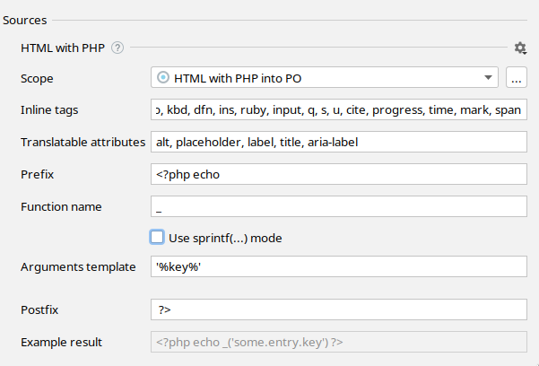

<h1>PHP views internationalization</h1>



Hello world!

⬇

<?php _('Hello world') ?>

<!-- messages.po: msgid "Hello world" -->

Hello world, <?php $user ?>!

⬇

<?php sprintf(_('Hello world, %1$s!'), $user) ?>

<!-- messages.po: msgid "Hello world, %1$s!" -->


# Features supported



# Configure hardcoded strings extraction from PHP views

The plugin should automatically configure itself for CodeIgniter, CakePHP, Zend and Laminas projects, but adjustments could be needed for custom setup and other frameworks.

{:width="721px" height="auto"}


Important! This source would only looks for hardcoded strings within HTML and outside of PHP snippets. To extract hardcoded strings from PHP snippets you have to configure [a PHP source]({{ 'php' | global_asset_url }}.html).




Three

different

keys.
<!-- ⬇ will be extracted into -->
<?php _('Three') ?>

<?php _('different') ?>

<?php _('keys.') ?>

One <b>inclusive</b> key.
<!-- ⬇ will be extracted into -->
<?php _('One <b>inclusive</b> key.') ?>








It could be any callable PHP structure that wraps arguments into parentheses:

* function: `_(…)`, `__(…)`,
* object method: `$this->trans(…)`, `$translator->trans(…)`,
* static method: `\Yii:app(…)`.




Recommended value for gettext, CodeIgniter, CakePHP and Zend/Laminas: `'%key%'` with `sprintf` mode enabled. 
Recommended value for Yii v2: `'%namespace%', '%key%', %map%`. 
Recommended value for Yii v3: `'%key%', %map%, '%namespace%'`.



## Supported language constructs

i18n Ally finds hardcoded user-facing strings are only detected inside HTML tags.

Placeholder names are determined automatically.

## What's not supported

* Using an array for message retrieval (common approach in PHP legacy codebases, for example `$lang['key']`).

## What strings are skipped

* Pure HTML markup with PHP snippets expressions, like `<a href="<?php route('home')?>"></a>`.
* All attributes except ones listed in "Translatable attribute names" preference.
* Content inside `script` and `pre` tags.
* Strings that looks like code: without letters, multiple words without spaces or `camelCased` ones.



Webhook <strong><?php echo $success ? 'succeeded' : 'failed' ?></strong>.





<?php if ($success) { ?>
    Webhook <strong>succeeded</strong>.
<?php } else { ?>
    Webhook <strong>failed</strong>.
<?php } ?>





<?php
    if ($success) {
        echo _('Webhook <strong>succeeded</strong>.')
    } else {
        echo _('Webhook <strong>failed</strong>.')
    }
?>


