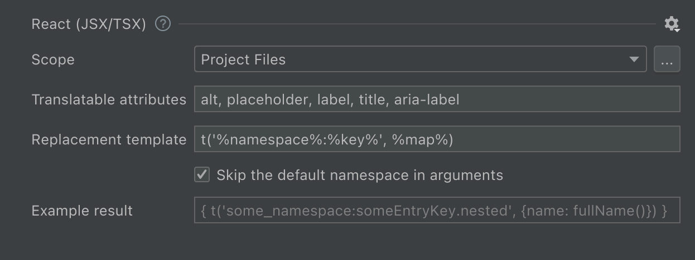

<h1>{{ page.title }}</h1>

<b>Important!</b> Always configure both Ract and <a href="js-and-ts.html">plain JavaScript sources</a> together.



Hello world!

⬇

{t('helloWorld')}

<!-- locales/en.js: helloWorld: 'Hello world!' -->

Hello, {user}!

⬇

{t('hello', {user: user})}

<!-- locales/en.js: helloWorld: 'Hello, {{user}}!' -->


# Features supported



# Configure hardcoded strings extraction from React (JSX/TSX) templates

The plugin should automatically configure itself for project with dependencies on `react-i18next`, but adjustments could be needed for custom setup.

{:width="629px" height="auto"}



## Inline tags

Extraction of strings with a special treatment of inline tags is not currently supported.




Recommended value for `react-i18next` packages: `t('%namespace%:%key%', %map%)`.



# Supported language constructs

All strings inside tags and translatable attributes are checked.

# What strings are skipped

* All attributes except ones listed in "Translatable attribute names" preference.
* Strings that looks like code: without letters, multiple words without spaces or `camelCased` ones.



return <>Webhook {isSuccess ? 'succeeded' : 'failed'}.</>;





return isSuccess
  ? return <>Webhook succeeded.</>
  : return <>Webhook failed.</>;





return isSuccess
  ? return <>{t('webhookSucceeded')}</>
  : return <>{t('webhookFailed')}</>;


